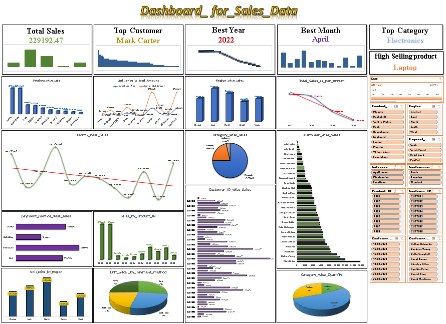

# Final Project - Excel Workbook Documentation

## 📑 Overview
This Excel workbook contains multiple sheets focused on data manipulation, scenario analysis, regression modeling, and dashboard visualization. 
Each sheet represents a unique step or tool used in data analytics. The file also contains a clean and insightful dashboard for decision-making support.

---

## 📄 Sheet Descriptions

### 1. `Time_Stamp`
- Contains date and time records for tracking when specific activities or entries were made.

### 2. `Task1`
- Demonstrates initial task setup or small exercises, possibly related to basic Excel operations like formulas or formatting.

### 3. `Final_project_dataset`
- This is the **core dataset** of the project.
- Includes key fields for further analysis such as product details, customer data, and transactions.

### 4. `Scenario Summary`
- Generated using **What-If Analysis → Scenario Manager**.
- Compares different cost scenarios (High Cost and Low Cost assumptions).
- Helps in understanding how changing cost prices impact profitability.

### 5. `cost_price & profit`
- Focuses specifically on the relationship between **Cost Price** and **Profit**.
- Likely used for Scenario Manager setup and Goal Seek tasks.

### 6. `Dashboard`
- A visually appealing summary of key metrics.
- Combines pivot tables, charts, and KPIs (Key Performance Indicators).
- Designed for quick insights into business performance.

### 7. `pivot_table`
- Contains dynamic pivot tables built from the dataset.
- Allows slicing and dicing the data based on different dimensions like product, customer, time, etc.

### 8. `Linear_Regression`
- Applies a basic **Linear Regression Model** inside Excel.
- Predicts outcomes based on independent variables.
- Good for forecasting and understanding trends.

### 9. `Filter_functions`
- Demonstrates use of **advanced Excel filter functions**.
- Useful for extracting specific subsets of the data easily.

### 10. `High_value_customer`
- Segments customers based on high transaction value.
- Possibly uses conditional filtering or advanced formulas to identify the most valuable customers.

---

## 📊 Dashboard Interpretation

- **Sales Overview**: Summarizes total sales, high-value transactions, and product performance.
- **Customer Insights**: Identifies top customers and their contribution to overall revenue.
- **Profitability Metrics**: Shows which products or customer segments are more profitable.
- **Trend Analysis**: Charts visualize time trends, helping understand seasonality or sales spikes.

**The dashboard is designed for easy decision-making, allowing stakeholders to quickly grasp important patterns and take action.**

---

## ✅ Key Excel Techniques Used
- Scenario Manager (What-If Analysis)
- Goal Seek
- Pivot Tables
- Data Filters
- Linear Regression (trend prediction)
- Dashboarding with Charts and KPIs

---

> **Prepared carefully to ensure professional standards are maintained.**  
> **Useful for final presentations, business analytics reports, and real-world data analysis projects.**

